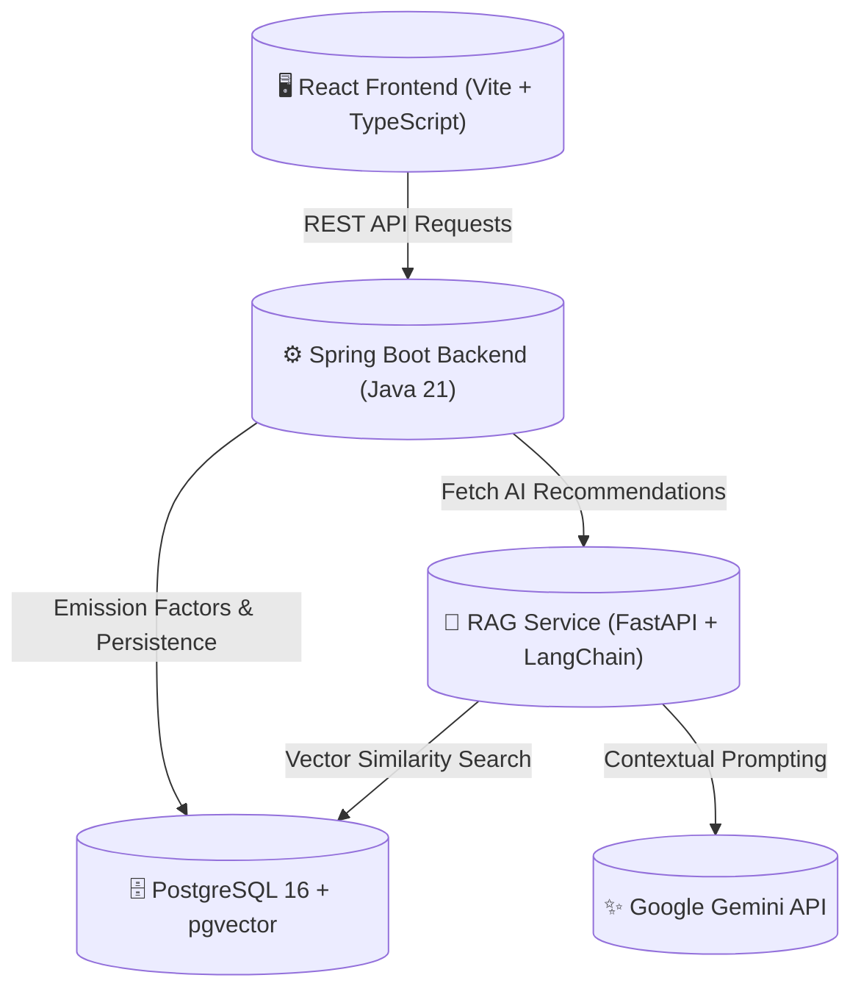

# 🌿 Circular Carbon — Industrial Emission Leak-Point Detector & Circular Alternative Recommender

> **HackOut'26** | **Theme:** Circular Carbon Ecosystem  
> **Live Web App:** [https://circular-carbon-frontend.onrender.com/](https://circular-carbon-frontend.onrender.com/)  
> **Repository:** [https://github.com/Kartik21407/Bug-fighter](https://github.com/Kartik21407/Bug-fighter)

[](https://spring.io/projects/spring-boot)
[](https://fastapi.tiangolo.com/)
[](https://react.dev/)
[](https://vitejs.dev/)
[](https://github.com/pgvector/pgvector)
[](https://ai.google.dev/)
[](https://render.com/)

---

## 📌 Overview

**Circular Carbon** is an intelligent, production-ready full-stack platform designed to help Small and Medium Enterprises (SMEs) and industrial plants identify their highest emission sources (leak-points) and implement actionable, cost-effective circular economy interventions.

### 🔑 Key Features
1. **Interactive Process Data Input:** Configurable industrial presets (Steel, Cement, Food Processing, Textile, Chemical) and custom input streams for energy, raw materials, industrial waste, and transportation.
2. **Deterministic & Standardized Emission Breakdown:** Accurate CO₂e footprint calculations categorized by Scope 1, Scope 2, and Scope 3 emissions with interactive visualizations (pie charts, leak-point bar graphs).
3. **AI-Powered Circular Interventions (RAG + Gemini):** Vector similarity search over industrial sustainability knowledge graphs powered by `pgvector` and Google Gemini LLM to generate customized, high-ROI circular economy recommendations.
4. **Actionable Decarbonization Roadmaps:** Clear implementation steps, estimated cost savings, and payback period metrics for each suggested intervention.

---

## 🏗️ System Architecture



---

## 🛠️ Tech Stack

| Layer | Technologies |
| :--- | :--- |
| **Frontend** | React 19, TypeScript, Vite, Tailwind CSS, Recharts, Lucide Icons |
| **Backend** | Java 21, Spring Boot 3.3, Spring Data JPA, Hibernate, Maven, OpenAPI / Swagger |
| **AI / RAG Service** | Python 3.11, FastAPI, Uvicorn, LangChain, Google Gemini API (`text-embedding-004`, `gemini-1.5-flash`) |
| **Database** | PostgreSQL 16 with `pgvector`, `uuid-ossp`, `pgcrypto` |
| **DevOps & Cloud** | Docker, Docker Compose, Render (Web Services + Static Site + Managed Postgres) |

---

## 📂 Repository Structure

```
Bug-fighter/
├── backend/                  # Spring Boot 3 Backend Service
│   ├── src/                  # Controllers, Services, Repositories, DTOs, Models
│   ├── pom.xml               # Maven configuration
│   └── Dockerfile            # Multi-stage Java 21 Docker build
├── frontend/                 # React + Vite + TypeScript Client
│   ├── src/                  # App, Dashboard, Input Form, Recommendation Panels
│   ├── package.json          # Frontend dependencies
│   └── Dockerfile            # Nginx production build
├── rag-service/              # Python FastAPI Recommendation Engine
│   ├── data/                 # Circular interventions knowledge base
│   ├── main.py               # RAG pipeline & Gemini integration
│   ├── requirements.txt      # Python dependencies
│   └── Dockerfile            # Python 3.11 container
├── data/                     # Seed data & emission factor SQL scripts
├── db-init/                  # Postgres extension initialization scripts
├── docker-compose.yml        # Full-stack local orchestration
├── .env.example              # Sample environment variables
└── README.md                 # Project documentation
```

---

## 🚀 Quick Start with Docker Compose

Run the entire full stack locally with a single command:

```bash
# 1. Clone repository
git clone https://github.com/Kartik21407/Bug-fighter.git
cd Bug-fighter

# 2. Copy environment template and add your Gemini API key
cp .env.example .env

# 3. Start all services (Database, RAG, Backend, Frontend)
docker-compose up -d --build
```

### Accessing Local Endpoints:
- **Frontend App:** [http://localhost](http://localhost) (or `http://localhost:5173`)
- **Backend Swagger UI:** [http://localhost:8080/swagger-ui](http://localhost:8080/swagger-ui)
- **Backend Health Check:** [http://localhost:8080/api/health](http://localhost:8080/api/health)
- **RAG Service Docs:** [http://localhost:8000/docs](http://localhost:8000/docs)
- **PostgreSQL Database:** `localhost:5433` (`circular_carbon`)

---

## 💻 Local Development (Without Docker)

### 1. Start Database
```bash
docker-compose up -d postgres
```

### 2. Run RAG Service (Python)
```bash
cd rag-service
python -m venv venv
# Windows:
.\venv\Scripts\activate
# Linux/Mac:
source venv/bin/activate

pip install -r requirements.txt
uvicorn main:app --reload --port 8000
```

### 3. Run Backend (Spring Boot)
```bash
cd backend
mvn spring-boot:run
```

### 4. Run Frontend (Vite)
```bash
cd frontend
npm install
npm run dev
```

---

## ☁️ Deployment on Render

This project is configured for seamless deployment on [Render](https://render.com/):

- **Live URL:** [https://circular-carbon-frontend.onrender.com/](https://circular-carbon-frontend.onrender.com/)
- **Backend API:** [https://circular-carbon-backend.onrender.com](https://circular-carbon-backend.onrender.com)
- **AI RAG Service:** [https://bug-fighter.onrender.com](https://bug-fighter.onrender.com)
- **Database:** Render Managed PostgreSQL 16

---

## ⚙️ Environment Variables Reference

| Variable | Service | Description |
| :--- | :--- | :--- |
| `DB_URL` | Backend | PostgreSQL JDBC connection URL |
| `DATABASE_URL` | RAG Service | PostgreSQL Python connection URI |
| `GEMINI_API_KEY` | RAG Service | Google AI Studio Gemini API Key |
| `GOOGLE_API_KEY` | RAG Service | Google AI Studio Gemini API Key |
| `RAG_SERVICE_URL` | Backend | URL to RAG recommendation endpoint (`/api/recommend`) |
| `CORS_ALLOWED_ORIGINS` | Backend | Allowed origin domains (e.g. `*` or frontend domain) |
| `VITE_API_BASE_URL` | Frontend | Base URL of the Spring Boot API backend |

---

## 👥 Contributors & Acknowledgements

Developed for **HackOut'26** by Team **Bug-fighter**.  
Special thanks to the open-source community for Spring Boot, FastAPI, pgvector, and React.
